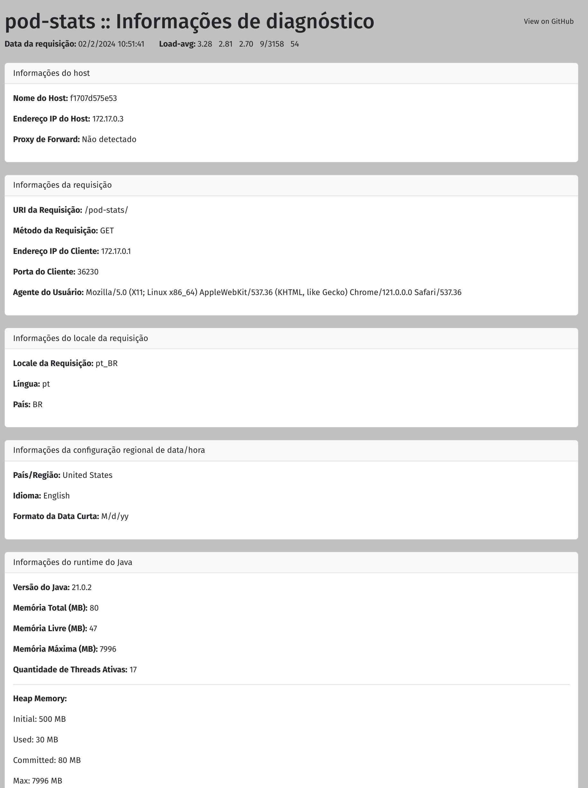

# Projeto web para mostrar informações de diagnóstico sobre pod/containers

### Basta deployar o pacote pod-stats.war em um container com um servidor de aplicação Java EE e acessar a url http://ip-do-seu-svc/pod-stats

.

